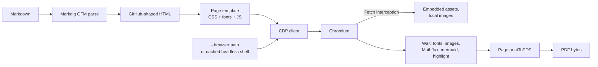

# markdowned — plan

`markdowned` renders a Markdown file to a PDF that looks the way github.com renders it.
It is a Native AOT CLI for Windows, macOS and Linux, built on .NET 10. It turns Markdown into
HTML shaped like GitHub's, then prints that HTML to PDF with headless Chromium.

```shell
markdowned README.md                           # → README.pdf next to the input
markdowned README.md -o out.pdf --paper Letter --landscape
markdowned README.md --browser "/usr/bin/google-chrome"
cat notes.md | markdowned - -o - > notes.pdf
```

## Fidelity principle

**Main goal: output as close to github.com as possible.** An approximation is acceptable, but
every deviation must be measured and kept deliberately small. Using Chromium means we reproduce
GitHub's **inputs** rather than its rendering engine:

- **Same HTML.** Our Markdown → HTML step emits the markup GitHub emits: heading wrappers and
  anchors, task-list classes, alert blocks, footnote section, `pl-*` highlight spans, and so on.
  It is checked against the HTML that GitHub renders for the same fixtures (see the fidelity
  harness: the repository contents endpoint, not `POST /markdown`).
- **Same CSS.** `github-markdown-css` (light theme), embedded.
- **Same client-side renderers.** These are the libraries GitHub runs: MathJax for math,
  mermaid for diagrams (default theme), and **starry-night**, GitHub's own highlighter, which
  uses the same TextMate grammars and emits `pl-*` classes.
- **Same fonts on every OS.** GitHub's font stack as it resolves on Linux is embedded: **Noto
  Sans** for body text, **Liberation Mono** for code and **Noto Color Emoji**. CJK and other
  scripts fall back to the system fonts, through Chromium.

If our HTML equals GitHub's HTML, the same CSS and engine give the same PDF. That makes fidelity
testable as a DOM comparison instead of geometry tolerances.

## Decisions

| Topic | Decision |
|---|---|
| Rendering | Markdig → HTML shaped like GitHub's → headless Chromium `Page.printToPDF`, driven by our own small DevTools Protocol (CDP) client. That client is AOT-safe: `ClientWebSocket` plus source-generated `System.Text.Json`. |
| Browser | If `--browser <path>` is passed, that executable is used (any Chromium-based browser). Otherwise **chrome-headless-shell** is downloaded once from Chrome for Testing into a per-user cache, pinned to the version built into the release and checked against its SHA-256. |
| Native AOT | Kept. The release ships as AOT zips plus a `dotnet tool`, as kartchrono does. |
| GFM scope (v1) | CommonMark, tables, task lists, strikethrough, autolinks, footnotes, alerts, YAML front matter, heading anchors, emoji shortcodes, raw HTML sanitised as GitHub does, syntax highlighting, math, Mermaid (every type mermaid supports). |
| Fonts | Noto Sans, Liberation Mono and Noto Color Emoji embedded and declared with `@font-face`. CJK and other scripts use the system fallback. |
| Remote images | Fetched by default. `--offline` blocks all network access, so failed images render as GitHub shows broken images and a warning goes to stderr. |
| Page | Plain `markdown-body` article. A4 portrait by default. `n / N` footer. Content is laid out at GitHub's README width and scaled to the printable width, so lines break where GitHub breaks them. Flags for `--paper`, `--landscape`, `--margin`. |
| Distribution | `markdowned` command. `Markdowned.Cli` dotnet tool on NuGet. AOT zips for `linux-x64`, `linux-arm64`, `osx-arm64`, `win-x64` on every GitHub release. |
| CI gates | Coverage 80 (fail) / 90 (warn), mutation 60. Raise them later. |
| Code style | Pure ecosystem, same as kartchrono-cli: `sealed record` with one interface, behaviour in getters, `IString`/`INumber`/`IBool`, `.editorconfig` + `dotnet format` + csharpier. |
| Delivery | Stacked PRs that the owner merges. Each PR closes an issue. Commits use the semantic-commit skill (`<type>: <subject>`) and PRs use the pr skill. |

## Architecture



### Projects (`src/`)

| Project | Contents |
|---|---|
| `Markdowned.Abstractions` | Interfaces only: document, HTML, browser, DevTools session, output |
| `Markdowned` | Namespaces `Markdown` (Markdig → GitHub HTML), `Page` (template and assets), `Browser` (locate, download, launch), `DevTools` (CDP client), `Printing` |
| `Markdowned.Cli` | Argument parsing and `Program.Main`. Packed as a dotnet tool and published as AOT. |
| `Tests/Markdowned.Tests` | Unit tests: HTML compared against recorded GitHub API output, CDP messages against recorded transcripts |
| `Tests/Markdowned.Integration.Tests` | Real Chromium: post-script DOM vs GitHub, PDF smoke checks. Runs in CI with a cached headless shell. |
| `assets/` (repo root) | `package.json` plus a build script. These bundle mermaid, MathJax, starry-night and github-markdown-css into vendored files that are committed under `src/Markdowned/Assets/`. Dependabot keeps them current through the npm ecosystem. |

The only .NET dependencies are `Markdig` (BSD-2) and `Pure.Primitives*`. Everything else uses
the BCL: `ClientWebSocket`, `HttpClient`, `ZipFile`, `System.Text.Json` with source generation,
and `Process`.

### Components

- **Markdown → HTML.** Custom Markdig renderers emit GitHub's exact structure:
  - `div.markdown-heading` / `a.anchor` with `user-content-` slugs, using GitHub's slug and
    duplicate rules.
  - `ul.contains-task-list`.
  - `div.markdown-alert-*` with the octicons inlined.
  - `section[data-footnotes]`.
  - `div.highlight.highlight-source-<lang>`.
  - Front matter rendered as a table.
  - `g-emoji` for shortcodes.
  - Math and mermaid placeholders.

  Raw HTML is sanitised with GitHub's allow-list, so scripts, event handlers, `style` and so on
  are removed. Parsing is checked against the GFM spec examples. Where Markdig and cmark-gfm
  disagree, a local fix makes us match GitHub.
- **Page.** An HTML template with `github-markdown-css`, `@font-face` rules for the embedded
  fonts, `@page` size and margins, a CSS width equal to GitHub's README content width, and the
  scripts: starry-night, MathJax configured like GitHub's, and mermaid with the default theme.
  When everything has finished rendering, the page resolves a single `window.markdownedReady`
  promise.
- **Browser.**
  - **`--browser <path>`:** launch that executable.
  - **No flag:** use `<cache>/chrome-headless-shell/<version>/<platform>/`. The cache is
    `$XDG_CACHE_HOME` or `~/.cache` on Linux, `~/Library/Caches` on macOS and
    `%LOCALAPPDATA%` on Windows. If the browser isn't there yet, it is downloaded from Chrome
    for Testing (about 115 MB zipped), verified against the SHA-256 embedded at release, and
    extracted with the executable bit set.
  - **Concurrency:** a file lock stops parallel runs from downloading twice.
  - **Progress:** download progress goes to stderr.
  - **Offline:** `--offline` with no cached browser fails with a clear hint.
  - **Pre-download:** `markdowned install-browser` downloads the browser ahead of time, for
    Docker images and offline machines.
- **Launch.** The browser starts with `--headless`, `--remote-debugging-port=0`, a temporary
  `--user-data-dir` and `--no-first-run`. `--no-sandbox` is added only when the process runs as
  root, as in containers. The WebSocket URL is read from stderr. The browser process and the
  profile directory are always cleaned up, even after a failure or Ctrl+C. If Linux shared
  libraries are missing, the error names the `apt` packages to install.
- **DevTools client.** JSON-RPC over a WebSocket, using only the commands we need:
  - `Target.*` to create and attach to a tab.
  - `Page.enable` and `Page.navigate`.
  - `Fetch.enable`/`requestPaused`. These serve the page, the assets and local images from a
    virtual origin, `https://markdowned.local/`. Remote image requests are allowed only when
    `--offline` is not set, and every other request is blocked.
  - `Runtime.evaluate` with `awaitPromise`, which waits for the ready promise.
  - `Page.printToPDF` with streaming (`IO.read`).
- **Printing.** `printToPDF` is called with the paper size and margins, a `scale` that fits
  GitHub's content width to the printable width, `printBackground`, and
  `displayHeaderFooter` with a `pageNumber / totalPages` footer. It also requests
  `generateDocumentOutline` (bookmarks from headings) and `generateTaggedPDF`. Links and
  internal anchors work automatically.

### CLI

```
markdowned <input.md | -> [-o|--output <file.pdf | ->]
           [--browser <path>] [--offline] [--timeout <seconds>]
           [--paper A4|Letter|Legal] [--landscape] [--margin <mm>]
           [--quiet] [--help] [--version]
markdowned install-browser
```

Exit codes are: 0 for success, 1 for bad arguments or I/O errors, 2 when the browser fails to
download or launch, and 3 for a render failure or timeout. Warnings go to stderr and do not
change the exit code.

## Fidelity harness

1. Each fixture under `src/Tests/Markdowned.Tests/Fidelity/*.md` is pushed, then fetched once
   from the repository contents endpoint with `Accept: application/vnd.github.html+json`, which
   returns **the exact HTML that GitHub shows on a file page** (`scripts/record-fixtures.sh`).
   `POST /markdown` is not used: it omits what the page adds (`markdown-heading` wrappers,
   anchors, `snippet-clipboard-content`). The recorded HTML is committed.
2. **Unit tests** compare our HTML with the recorded HTML after normalising it: attribute order,
   whitespace, and the highlight spans GitHub adds on the server.
3. **Integration tests** run both HTML documents through our page in Chromium and compare the
   DOM after the scripts have run, and optionally a screenshot pixel diff.
4. Known deviations are listed in `docs/fidelity.md`.

## Delivery: PR sequence

Each step is one stacked PR with its own issue.

| # | PR | Notes |
|---|---|---|
| 1 | `chore: replace template placeholders` | Closes #1. Covers README, CHANGELOG, devcontainer name, dependabot dirs (plus the devcontainers and npm ecosystems), CLAUDE.md, this plan, and the GitHub repo description. |
| 2 | `build: add solution skeleton` | Adds the projects and tests, `--help`/`--version`, stryker config, CI thresholds of 80/90/60, `workflow_call`, and an AOT publish smoke job on PRs so trim/AOT warnings fail the build. Checks that Markdig is AOT-clean. |
| 3 | `ci: add release workflow` | Replaces `publish-nuget.yml` with kartchrono's `release.yml`: an AOT matrix, the NuGet tool package and a GitHub release. |
| 4 | `feat: add DevTools client and launch browser` | Adds `--browser`, launch and cleanup, and printing a static HTML string to PDF. |
| 5 | `feat: download pinned headless shell` | Adds the cache, the SHA-256 check, the lock, progress and `install-browser`. The release pins the version and its hashes. |
| 6 | `test: record GitHub fidelity fixtures` | Adds the API recording script, the first fixtures and the HTML comparison. |
| 7 | `feat: render GitHub-shaped HTML` | Covers core blocks, headings and anchors, tables, task lists, strikethrough and autolinks. |
| 8 | `feat: add page template and print options` | Adds the CSS, fonts, scale to GitHub width, paper, margins, footer, outline and the end-to-end CLI. Released as **0.1.0**. |
| 9 | `feat: alerts, footnotes, front matter, emoji` | |
| 10 | `feat: sanitise raw HTML like GitHub` | |
| 11 | `feat: serve local and remote images` | Adds Fetch interception, `--offline` and `--timeout`. |
| 12 | `build: vendor web assets` | Adds the `assets/` bundling script, the licences and `THIRD-PARTY-NOTICES`. |
| 13 | `feat: highlight code with starry-night` | |
| 14 | `feat: render math with MathJax` | |
| 15 | `feat: render mermaid diagrams` | |
| 16 | `test: add Chromium integration tests` | CI caches the headless shell. Adds DOM comparison and PDF smoke checks. |
| 17 | `ci: bump pinned Chrome version weekly` | A scheduled job opens a PR with the new version and its hashes. |
| — | **1.0.0** | Released once all of v1 scope has landed. |

Minor versions are released along the way, and the changelog skill updates `CHANGELOG.md` for
each one.

## Not in v1

- Dark theme
- Watch mode
- Batch processing of folders
- Custom CSS
- Table of contents page
- Server-side rendering (as GitHub's API does), to remove the browser download

## Risks

- **Browser dependency.**
  - **Size:** the first run without `--browser` downloads about 115 MB (about 300 MB
    unpacked).
  - **Linux libraries:** a minimal Linux machine needs extra shared libraries (`libnss3`,
    `libgbm1`, …). The README lists the packages, and the launch error points to them.
- **Scripts in the page.** Rendering untrusted Markdown with JavaScript enabled is safe only
  if sanitising matches GitHub's allow-list and Fetch interception blocks everything except
  assets and images. Both have dedicated tests.
- **Readiness.** MathJax, mermaid and image loading must all signal completion. A hang
  becomes an error after `--timeout` rather than an incomplete PDF.
- **Version drift.** GitHub updates its CSS, mermaid and MathJax over time. Dependabot (npm)
  and the weekly Chrome bump keep our versions current, and the fixtures catch regressions.
- **Markdig vs cmark-gfm.** Edge cases in the GFM spec may differ. Each difference gets a
  fixture and a fix, or is recorded in `docs/fidelity.md`.
- **AOT.** The CDP payloads need source-generated JSON contexts, and the AOT smoke job in PR 2
  catches regressions.
- **Binary size.** The AOT engine plus about 10 MB of JS and about 13 MB of fonts comes to an
  estimated 30 MB.

## Prior art

| Project | Stack | How markdowned differs |
|---|---|---|
| [Markdown2Pdf](https://github.com/Flayms/Markdown2Pdf) (.NET, MIT) | Markdig + PuppeteerSharp, github-markdown-css, MathJax, mermaid, highlight.js. Downloads Chromium automatically. | It is the closest match. It uses highlight.js (not GitHub's highlighter), loads modules from a CDN by default, does not make Markdig emit GitHub's HTML structure, and does not support AOT. |
| [md-to-pdf](https://www.npmjs.com/md-to-pdf) (Node) | marked + Puppeteer + highlight.js. Forks such as md-to-pdf-ng add mermaid. | Needs Node, uses marked's HTML rather than GitHub's, and its look is configurable rather than GitHub-exact. |
| [grip](https://github.com/sihitejulio/grip), [gh-markdown-preview](https://aur.archlinux.org/packages/gh-markdown-preview), go-grip, meread | Local preview servers that use the GitHub API or GitHub's CSS | Preview in a browser only, no PDF. Most need network access. |

## Open questions

1. ~~**GitHub's README width.**~~ Measured on github.com (2026-10-05, headless Chromium, desktop
   viewports of 1440 px and wider): the README `article` is **838 px** wide (823 px at 1280 px).
   The template uses 838 px; there is no `--width` override yet.
2. **MathJax output mode.** Not verifiable from outside; SVG was chosen (no web fonts to embed).
